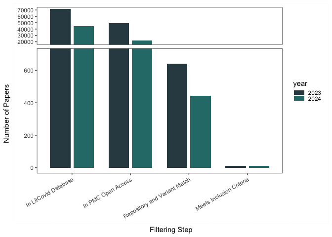
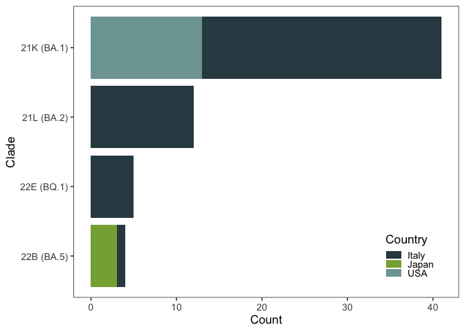
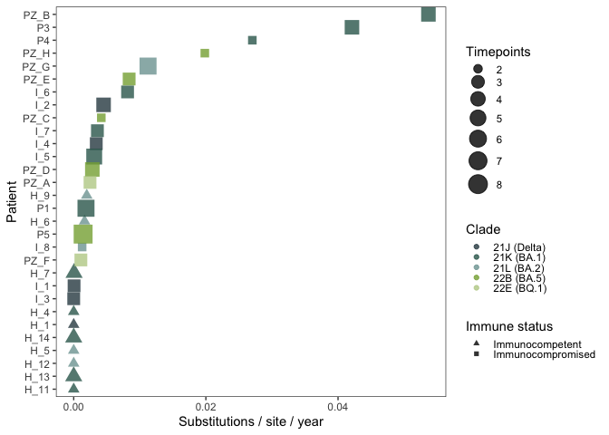
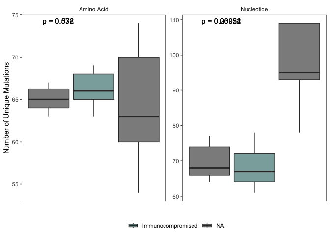
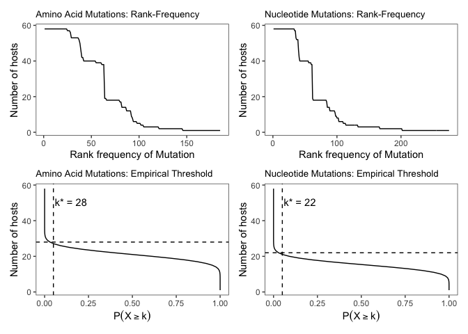
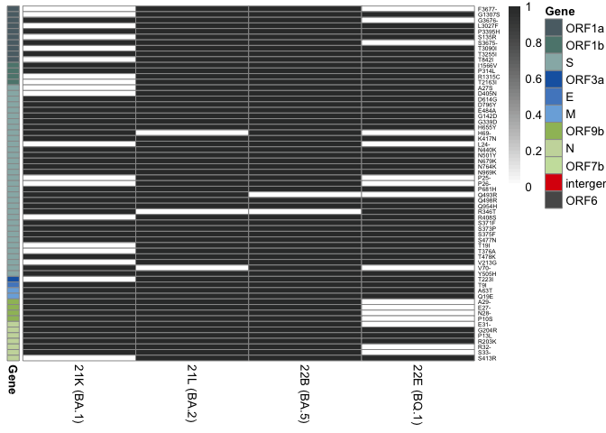
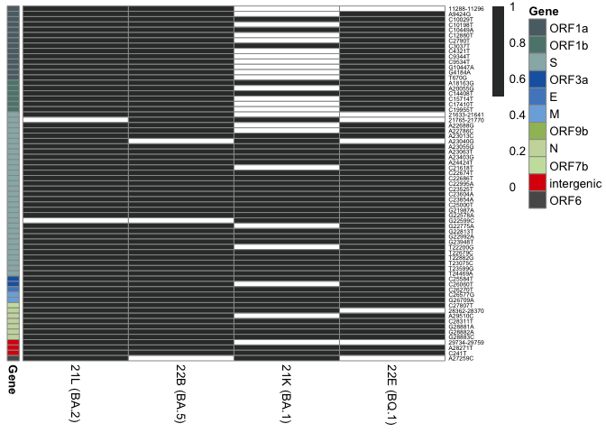
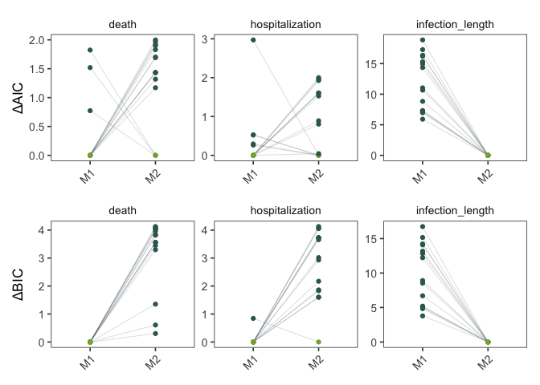

A Metadata-Driven Framework for Strengthening Pathogen Genomics: Lessons
from SARS-Cov-2
================

<style>
body {
text-align: left;
}
</style>

## Section 1: Literature Search and Filtering

A literature search was performed using LitCovid for PMC articles
published after January 2023. Open-access articles were screened with
regular expressions to identify (1) sequence repositories (GenBank, SRA,
GISAID), (2) accession number patterns, and (3) references to specific
SARS-CoV-2 variants (BA.2, BA.2.86, JN.1, KP.2, KP.3, KP.3.1.1, LB.1,
XEC, JN.1.7, and JN.1.18). Two reviewers independently assessed articles
for inclusion criteria: reporting original SARS-CoV-2 genome sequences,
depositing data to GenBank or GISAID, and providing sequence-specific
metadata.

``` r
library(tidyverse)
library(ggbreak)
library(egg)

paper_counts_df <- data.frame(
  year = c(rep("2023", 4), rep("2024", 4)),
  step = rep(
    c(
      "In LitCovid Database",
      "In PMC Open Access",
      "Repository and Variant Match",
      "Meets Inclusion Criteria"
    ), 
    2
  ),
  value = c(71692, 48959, 640, 11, 44908, 21790, 442, 11)
)

paper_counts_df$step <- factor(
  paper_counts_df$step,
  levels = c(
    "In LitCovid Database",
    "In PMC Open Access",
    "Repository and Variant Match",
    "Meets Inclusion Criteria"
  )
)

ggplot(paper_counts_df, aes(x = step, y = value, fill = year)) +
  geom_col(position = position_dodge(width = 0.8), width = 0.7) +
  scale_y_break(c(700, 18000), scales = 0.3) +
  ylab("Number of Papers") +
  xlab("Filtering Step") +
  theme_article() +
  scale_fill_manual(values = c("2023" = "#324851", "2024" = "#2B7A78")) +
  theme(axis.text.x = element_text(angle = 30, hjust = 1))
```

<div class="figure" style="text-align: center">


<p class="caption">
Number of article records retained at each stage of the filtering
process.
</p>

</div>

## Section 2: Metadata Completeness

We performed manual extraction of sequence-specific metadata and
evaluated the ceiling of metadata completeness by benchmarking our
extracted data against existing GenBank records and the max metadata
type that was able to be recovered.

``` r
# Load external libraries at the top
library(pheatmap)
library(dplyr)

# Read the CSV files and convert to matrices; use snake_case for variable names
collected_metadata_matrix <- read.csv("collected_study_metadata.csv", row.names = 1) %>% as.matrix()
genbank_metadata_matrix <- read.csv("genbank_study_metadata.csv", row.names = 1) %>% as.matrix()

# Sum the matrices for completeness
total_metadata_matrix <- collected_metadata_matrix + genbank_metadata_matrix

# Print completeness percentages with explicit calculations
genbank_completeness <- round(sum(genbank_metadata_matrix == 1) / 528 * 100, 1)
cat(paste("Completeness from GenBank only:", genbank_completeness, "%\n"))
```

    ## Completeness from GenBank only: 21.6 %

``` r
papers_completeness <- round(sum(collected_metadata_matrix == 1) / 528 * 100, 1)
cat(paste("Completeness from papers only:", papers_completeness, "%\n"))
```

    ## Completeness from papers only: 52.8 %

``` r
# Heatmap plot: arguments are explicit, object names are in snake_case
pheatmap(
  total_metadata_matrix,
  border_color = "#0a0a0a",
  color = c("#FEFFFF", "#2B7A78", "#17252A"),
  fontsize = 12,
  cluster_rows = FALSE,
  cluster_cols = FALSE
)
```

<div class="figure" style="text-align: center">


<p class="caption">
Heatmap of sequence-specific patient metadata collected. Dark blocks
represent metadata in GenBank, light blocks represent metadata extracted
from publication text, and white blocks represent missing metadata.
Local refers to state or city versus county level location. CT refers to
RT-PCR cycle threshold with CT_precision indicating either exact value
or if a range was reported. Symptom_status refers to either asymptomatic
or symptomatic cases and Symptoms lists the reported symptoms.
Vaccination_Status refers to whether a patient was vaccinated and
Vaccine_dose specifies the number of doses received prior to sequencing.
Comorbidity_Status refers to the presence or absence of comorbidities
and Comorbidity lists the specific conditions reported.
</p>

</div>

``` r
# Calculate completeness for each column in percentage
completeness_percent <- colMeans(total_metadata_matrix > 0) * 100

# Build completeness data frame using snake_case and explicit arguments
completeness_df <- data.frame(
  study = names(completeness_percent),
  completeness = completeness_percent,
  stringsAsFactors = FALSE
) %>%
  mutate(
    year = case_when(
      grepl("2023", study) ~ "2023",
      grepl("2024", study) ~ "2024",
      TRUE ~ NA_character_
    )
  ) %>%
  filter(year %in% c("2023", "2024"))

# Wilcoxon test for group completeness comparisons; always explicit argument names
wilcox.test(completeness ~ year, data = completeness_df, exact = FALSE)
```

    ## 
    ##  Wilcoxon rank sum test with continuity correction
    ## 
    ## data:  completeness by year
    ## W = 24, p-value = 0.02949
    ## alternative hypothesis: true location shift is not equal to 0

## Section 3: Core Data Preparation and Merging

A significant effort was made to clean, normalize, and consolidate data
from all sources. This involved:

1.  Loading metadata files for each study.
2.  Standardizing column names and categorical variable values (e.g.,
    ‘sex’, ‘hospitalization’).
3.  Creating new features like ‘AgeGroup’ and ‘treatment_type’.
4.  Merging the cleaned metadata with genomic data from Nextclade.
5.  Filtering out low-quality sequences and non-Omicron clades.
6.  Joining the data with the document cluster assignments from Section
    3.

The cleaned dataset (`Supplementary_Data.csv`) is used for all
subsequent analyses.

``` r
library(dplyr)
library(lubridate)

metadata_files <- list.files("metadata", pattern = "\\.csv$", full.names = TRUE)

# Read each file, add study prefix and standardize columns
metadata_list <- lapply(metadata_files, function(file_path) {
  data <- read.csv(file_path, stringsAsFactors = FALSE)
  file_name <- basename(file_path)
  study_prefix <- sub("\\.csv$", "", file_name)
  data$study <- study_prefix
  data$ct <- as.character(data$ct)
  colnames(data) <- c(
    "genbank","id","sex","age","hospitalization","death","infection_length",
    "vaccination","vaccine_dose","monoclonal_ab","antivirals","biological_therapy",
    "oxygen_therapy","ct","ct_precision","immune_state","collection_date",
    "commorbidity","commorbidity_type","location_country", "location_city",
    "sample_type","symptom","symptom_type","CCI_score","study_id"
  )
  return(data)
})

# Combine all study metadata into a single data frame
metadata_df <- do.call(rbind, metadata_list)

# Clean up categories and missing values
metadata_df$sex[metadata_df$sex %in% c("", "U")] <- NA
metadata_df$hospitalization[metadata_df$hospitalization %in% c("", "unknown", "N/a")] <- NA
metadata_df$hospitalization[metadata_df$hospitalization %in% c("YES", "yes", "uyes")] <- "Yes"
metadata_df$hospitalization[metadata_df$hospitalization %in% c("no", "yno", " no")] <- "No"

metadata_df$symptom_type[metadata_df$symptom_type %in% c("symptomatic")] <- "Symptomatic"
metadata_df$symptom_type[metadata_df$symptom_type %in% c("asymptomatic")] <- "Asymptomatic"
metadata_df$symptom_type[metadata_df$symptom_type %in% c("\nunknown", "", "unknown\nunknown", "unknown")] <- NA

metadata_df$immune_state[metadata_df$immune_state %in% c("I", "immunocompromised")] <- "Immunocompromised"
metadata_df$immune_state[metadata_df$immune_state %in% c("H")] <- "Healthy"

metadata_df$vaccination[metadata_df$vaccination %in% c("Moderna mRNA", "Pfizer mRNA", "yes")] <- "Yes"
metadata_df$vaccination[metadata_df$vaccination %in% c("")] <- NA
metadata_df$vaccination[metadata_df$vaccination %in% c("no")] <- "No"

metadata_df$age[metadata_df$age %in% c("")] <- NA

metadata_df <- metadata_df %>%
  mutate(
    numeric_age = ifelse(grepl("-", age), NA, as.numeric(age)),
    age_group = ifelse(
      is.na(numeric_age),
      age,
      as.character(cut(numeric_age,
                       breaks = c(0, 20, 30, 40, 50, 60, 70, 80, Inf),
                       right = FALSE,
                       labels = c(
                         "Under 19", "20-29", "30-39", "40-49", "50-59", "60-69", "70-79", "80+"
                       )))
    )
  )

# Standardize all spelling, white spaces, and custom bins for age_group
metadata_df$age_group[metadata_df$age_group %in% c("61-65", "66-70", " 61-65", " 66-70")] <- "60-69"
metadata_df$age_group[metadata_df$age_group %in% c(" 106-110", " 91-95", " 101-105", " 96-100")] <- "80+"
metadata_df$age_group[metadata_df$age_group %in% c(" 6-10", " 0-5", " 1-5")] <- "Under 19"
metadata_df$age_group[metadata_df$age_group %in% c(" 76-80", " 71-75")] <- "70-79"
metadata_df$age_group[metadata_df$age_group %in% c(" 11-15", " 16-20")] <- "Under 19"
metadata_df$age_group[metadata_df$age_group %in% c(" 86-90", " 81-85")] <- "80+"
metadata_df$age_group[metadata_df$age_group %in% c(" 36-40", " 31-35", "36-40")] <- "30-39"
metadata_df$age_group[metadata_df$age_group %in% c(" 41-45", " 46-50")] <- "40-49"
metadata_df$age_group[metadata_df$age_group %in% c(" 26-30", " 21-25")] <- "20-29"
metadata_df$age_group[metadata_df$age_group %in% c(" 51-55", " 56-60")] <- "50-59"

# Date formatting with lubridate
metadata_df$collection_date <- mdy(metadata_df$collection_date)

metadata_df$commorbidity[metadata_df$commorbidity %in% c("yes")] <- "Yes"
metadata_df$commorbidity[metadata_df$commorbidity %in% c("", "N/a", "none")] <- NA

metadata_df$ct_precision[metadata_df$ct_precision %in% c("")] <- NA
metadata_df$ct_precision[metadata_df$ct_precision %in% c("range ")] <- "range"

metadata_df$death[metadata_df$death %in% c("no")] <- "No"
metadata_df$death[metadata_df$death %in% c("yes")] <- "Yes"
metadata_df$death[metadata_df$death %in% c("")] <- NA

metadata_df$ct[metadata_df$ct %in% c("<30.")] <- "<30"
metadata_df$ct[metadata_df$ct %in% c("16.3 -23", "16.3- 23")] <- "16.3 - 23"

metadata_df$symptom[metadata_df$symptom %in% c("")] <- NA
metadata_df$symptom[metadata_df$symptom %in% c("asymptomatic", "Asymptomatic")] <- NA

metadata_df$monoclonal_ab[metadata_df$monoclonal_ab %in% c("", "none")] <- NA
metadata_df$antivirals[metadata_df$antivirals %in% c("", "none", "0")] <- NA
metadata_df$biological_therapy[metadata_df$biological_therapy %in% c("", "none")] <- NA

metadata_df$oxygen_therapy[metadata_df$oxygen_therapy %in% c("NIV")] <- "Non-invasive ventilation"
metadata_df$oxygen_therapy[metadata_df$oxygen_therapy %in% c("HFNC")] <- "high-flow nasal cannula"
metadata_df$oxygen_therapy[metadata_df$oxygen_therapy %in% c("IMV")] <- "invasive mechanical ventilation"

metadata_df$sample_type[metadata_df$sample_type %in% c(
  "Nasopharyngeal (NP)","nasopharyngeal swab","Nasopharyngeal swabs",
  "upper resp_npats","nasopharyngeal/oropharyngeal swabs",
  "nasopharyngeal and oropharyngeal swabs","upper resp_nps",
  "Pharyngeal / Nasopharyngeal swab","upper resp_npsts",
  "Nasopharyngeal and pharyngeal swab","Pharyngeal or Nasopharyngeal swab",
  "Oropharyngeal swab","nasopharyngeal swabs",
  "Nasopharynx","nasal or pharyngeal swab ",
  "nasopharyngeal  swabs","Pharyngeal swab"
)] <- "Nasopharyngeal swab"

metadata_df$sample_type[metadata_df$sample_type %in% c(
  "anterior nares (AN) swabs",
  "nasal swab",
  "nasal or pharyngeal swab",
  "Anterior Nares",
  "nose and throat swabs"
)] <- "Anterior nares swab"

metadata_df$sample_type[metadata_df$sample_type %in% c(
  "Throat swabs",
  "lower resp_ta",
  "Bronchoalveolar lavage"
)] <- "Lower respiratory tract swab"

metadata_df$monoclonal_ab[metadata_df$monoclonal_ab %in% c("BAM/ETE")] <- "Bamlanivimab and Etesevimab"
metadata_df$monoclonal_ab[metadata_df$monoclonal_ab %in% c("CAS/IMD")] <- "Casirivimab and Imdevimab"
metadata_df$antivirals[metadata_df$antivirals %in% c("RMD")] <- "Remdesiver"

# Derive treatment_type column
metadata_df <- metadata_df %>%
  rowwise() %>%
  mutate(
    treatment_type = paste(
      c(
        if (!is.na(monoclonal_ab)) "monoclonal_ab",
        if (!is.na(antivirals)) "antivirals",
        if (!is.na(biological_therapy)) "biological_therapy"
      ),
      collapse = "+"
    )
  ) %>%
  ungroup() %>%
  mutate(treatment_type = ifelse(treatment_type == "", NA, treatment_type))

# Map commorbidity types to descriptive labels
metadata_df$commorbidity_type[metadata_df$commorbidity_type %in% c("HD")] <- "Cardiovascular disease"
metadata_df$commorbidity_type[metadata_df$commorbidity_type %in% c("CCV")] <- "Chronic cerebral vasculopathy"
metadata_df$commorbidity_type[metadata_df$commorbidity_type %in% c("DM2", "Type 2 diabetes")] <- "Diabetes mellitus type 2"
metadata_df$commorbidity_type[metadata_df$commorbidity_type %in% c("CKD")] <- "Chronic kidney disease"
metadata_df$commorbidity_type[metadata_df$commorbidity_type %in% c("CHL")] <- "Combined hyperlipidemia"
metadata_df$commorbidity_type[metadata_df$commorbidity_type %in% c("HM", "Diffuse B-cell lymphoma", "NHL")] <- "Hematologic malignancy"
metadata_df$commorbidity_type[metadata_df$commorbidity_type %in% c("ST")] <- "Solid tumor"
metadata_df$commorbidity_type[metadata_df$commorbidity_type %in% c("CLiD")] <- "Chronic liver disease"
metadata_df$commorbidity_type[metadata_df$commorbidity_type %in% c("CLuD")] <- "Chronic lung disease"

# Read Nextclade results
nextclade_df <- read.delim("nextclade.tsv", sep = "\t")
colnames(nextclade_df)[colnames(nextclade_df) == "seqName"] <- "genbank"

# Merge Nextclade and metadata, filter, and write output
final_df <- full_join(nextclade_df, metadata_df, by = "genbank") %>%
  filter(
    !is.na(study),
    qc.overallStatus != "bad",
    !clade_who %in% c("Delta", "Kappa", "Mu"),
    !clade_display %in% c("20A", "20B")
  ) %>%
  mutate(clade_display = ifelse(clade_display == "recombinant", "Recombinant", clade_display))

#write.csv(final_df, "cleaned_data_core.csv", row.names = FALSE)
#Reanamed as "Supplementary_Data.csv" for publication
```

## Section 4: Intra-host Viral Evolution

We investigated the rate of viral evolution within individual hosts.
Using a time-dated phylogenetic tree (`treedater`), we estimated the
substitution rate for each patient with longitudinal samples. The plot
below shows these intra-host rates, highlighting differences between
immune status and viral clade. A linear model was used to formally test
the association between substitution rate, immune status, and clade.

``` r
selected_studies <- c(
  "Manuto_2024", 
  "Gonzalez_Reiche_2023", 
  "Igari_2024", 
  "Pavia_2024"
)

supplementary_data_df <- read.csv("Supplementary_Data.csv", stringsAsFactors = FALSE)

supplementary_data_df %>%
  filter(study_id %in% selected_studies) %>%
  count(clade_display, location_country) %>%
  group_by(clade_display) %>%
  mutate(total = sum(n)) %>%
  ungroup() %>%
  ggplot(aes(x = reorder(clade_display, total), y = n, fill = location_country)) +
    geom_col() +
    coord_flip() +
    scale_fill_manual(values = c("#324851", "#86AC41", "#7DA3A1")) +
    theme_article(base_size = 13) +
    labs(y = "Count", x = "Clade", fill = "Country") +
    theme(
      legend.position = c(0.95, 0.05),
      legend.justification = c("right", "bottom"),
      legend.background = element_rect(fill = "transparent"),
      legend.box.background = element_rect(fill = "transparent", color = NA)
    )
```

<div class="figure" style="text-align: center">


<p class="caption">
Distribution of SARS-CoV-2 lineages by country used in case 2.
Illustrates analytical limit of Genbank data.
</p>

</div>

``` r
#library(treedater)
# Note: Phylogenetic analysis was done using iqtree2.
#module load iq-tree-2.2.2.7-gcc-12.1.0
#iqtree2 -s case_2.fa -m GTR+G -T 8 -bb 1000 -redo -pre phylo
 
host_rates_df <- read.csv("host_rates.csv", stringsAsFactors = FALSE)

lm_result <- lm(slope ~ immune_status + clade_display, data = host_rates_df)
print(summary(lm_result))
```

    ## 
    ## Call:
    ## lm(formula = slope ~ immune_status + clade_display, data = host_rates_df)
    ## 
    ## Residuals:
    ##       Min        1Q    Median        3Q       Max 
    ## -0.015391 -0.004286 -0.002020  0.002118  0.036427 
    ## 
    ## Coefficients:
    ##                                 Estimate Std. Error t value Pr(>|t|)  
    ## (Intercept)                    -0.009210   0.006691  -1.377   0.1814  
    ## immune_statusImmunocompromised  0.013509   0.005209   2.594   0.0159 *
    ## clade_display21K (BA.1)         0.012951   0.006332   2.045   0.0519 .
    ## clade_display21L (BA.2)         0.006738   0.007493   0.899   0.3774  
    ## clade_display22B (BA.5)         0.003030   0.007476   0.405   0.6889  
    ## clade_display22E (BQ.1)        -0.002522   0.009848  -0.256   0.8001  
    ## ---
    ## Signif. codes:  0 '***' 0.001 '**' 0.01 '*' 0.05 '.' 0.1 ' ' 1
    ## 
    ## Residual standard error: 0.0117 on 24 degrees of freedom
    ## Multiple R-squared:  0.3166, Adjusted R-squared:  0.1743 
    ## F-statistic: 2.224 on 5 and 24 DF,  p-value: 0.0849

``` r
ggplot(
  host_rates_df, 
  aes(
    x = abs(slope), 
    y = reorder(patient, abs(slope)),
    shape = immune_status,
    color = clade_display,
    size = n_points
  )
) + geom_point(alpha = 0.8) +
  scale_color_manual(values = c("#324851", "#34675c", "#7DA3A1", "#86AC41", "#bccf95")) +
  scale_shape_manual(values = c(17, 15)) +
  scale_size_continuous(range = c(3, 7)) +
  labs(
    x = "Substitutions / site / year",
    y = "Patient",
    shape = "Immune status",
    color = "Clade",
    size = "Timepoints"
  ) +
  theme_article()
```

<div class="figure" style="text-align: center">


<p class="caption">
Dot plot of substitution rate per patient.
</p>

</div>

## Section 5: Mutation Burden by Immune Status

We analyzed the mutation landscape across patients, distinguishing
between immunocompetent and immunocompromised hosts. First, we compared
the total number of unique amino acid (AA) and nucleotide (NT) mutations
between the two groups. The boxplot shows that immunocompromised
patients tend to have a higher mutation burden.

``` r
library(ggpubr)
supplementary_data_df <- read.csv("Supplementary_Data.csv", stringsAsFactors = FALSE)

filtered_df <- supplementary_data_df %>% 
  filter(study_id %in% selected_studies)

aa_long_df <- filtered_df %>%
  pivot_longer(
    cols = c(aaSubstitutions, aaDeletions, aaInsertions),
    names_to = "mutation_type",
    values_to = "mutations"
  ) %>%
  mutate(mutations = str_remove(mutations, ",\\s*$")) %>%
  separate_rows(mutations, sep = ",") %>%
  separate(mutations, into = c("gene", "mutation"), sep = ":") %>%
  filter(!is.na(mutation)) %>%
  mutate(gene_mutation = paste0(gene, "_", mutation))

nt_long_df <- filtered_df %>%
  pivot_longer(
    cols = c(substitutions, deletions, insertions, frameShifts),
    names_to = "mutation_type",
    values_to = "mutations"
  ) %>%
  mutate(mutations = str_remove(mutations, ",\\s*$")) %>%
  separate_rows(mutations, sep = ",") %>%
  filter(!is.na(mutations) & trimws(mutations) != "")

mutation_summary_df <- filtered_df %>%
  select(id, immune_state) %>% distinct() %>%
  left_join(
    aa_long_df %>% group_by(id) %>% summarise(aa_mutation_count = n_distinct(gene_mutation)),
    by = "id"
  ) %>%
  left_join(
    nt_long_df %>% group_by(id) %>% summarise(nt_mutation_count = n_distinct(mutations)),
    by = "id"
  )

combined_mutations_df <- mutation_summary_df %>%
  pivot_longer(
    cols = c(aa_mutation_count, nt_mutation_count),
    names_to = "mutation_level",
    values_to = "mutation_count"
  ) %>%
  mutate(mutation_level = ifelse(mutation_level == "aa_mutation_count", "Amino Acid", "Nucleotide"))

ggplot(
  combined_mutations_df,
  aes(x = immune_state, y = mutation_count, fill = immune_state)
) +
  geom_boxplot(alpha = 0.9, width = 0.9, outlier.shape = NA) +
  facet_wrap(~mutation_level, scales = "free_y") +
  labs(x = "", y = "Number of Unique Mutations", fill = "") +
  egg::theme_article() +
  scale_fill_manual(values = c(
    "Immunocompetent" = "#324851",
    "Immunocompromised" = "#7DA3A1"
  )) +
  theme(
    legend.position = "bottom",
    axis.text.x = element_blank(),
    axis.ticks.x = element_blank()
  ) +
  ggpubr::stat_compare_means(label = "p.format", method = "wilcox.test", size = 4)
```

<div class="figure" style="text-align: center">


<p class="caption">
Boxplots comparing the number of unique amino acid and nucleotide
mutations between immunocompetent and immunocompromised patients,
p-values from Wilcoxon tests are shown.
</p>

</div>

## Section 6: Identifying Recurrent Mutations

To identify mutations that occur more frequently than expected by chance
(i.e., recurrent mutations), we developed an empirical statistical
threshold.

``` r
library(patchwork)
library(broom)
library(logistf)

mutation_plots <- function(df, mut_col, label_y = "Number of hosts",
   title_prefix = "") {
   b <- df %>% distinct(id, !!sym(mut_col), clade_display)
   c <- b %>% count(!!sym(mut_col), name = "n_hosts")
   d <- b %>% count(!!sym(mut_col), clade_display) %>%
      count(!!sym(mut_col), name = "n_clades")
   g <- c %>% left_join(d, by = mut_col)
   N <- n_distinct(b$id)
   p0 <- mean(c$n_hosts) / N
   g2 <- g %>% mutate(
      p_binom = pbinom(n_hosts - 1, size = N, prob = p0, lower.tail = FALSE),
      p_adj   = p.adjust(p_binom, method = "BH"))
   ks   <- seq_len(N)
   p_ks <- pbinom(ks - 1, size = N, prob = p0, lower.tail = FALSE)
   threshold_k <- ks[which(p_ks < 0.05)[1]]
   mut_stats <- c %>% arrange(desc(n_hosts)) %>% mutate(rank = row_number())
   tail_df <- tibble(k = ks, p = p_ks)
   p_rank <- ggplot(mut_stats, aes(x = rank, y = n_hosts)) +
      geom_line() +
      labs(x = "Rank frequency of Mutation", y = label_y, 
         title = paste(title_prefix, "Rank-Frequency")) +
      theme_article()+theme(plot.title = element_text(size = 10))
   y_text <- max(ks) * 0.8
   p_empirical <- ggplot(tail_df, aes(x = p, y = k)) +
      geom_line() +
      geom_hline(yintercept = threshold_k, linetype = "dashed") +
      geom_vline(xintercept = 0.05, linetype = "dashed") +
      annotate("text", y = y_text, x = 0.15, 
         label = paste0("k* = ", threshold_k), vjust = -0.5) +
      labs(y = label_y, x = expression(P(X >= k)), 
         title = paste(title_prefix, "Empirical Threshold")) +
      egg::theme_article() +theme(plot.title = element_text(size = 10))
   list(rank = p_rank, empirical = p_empirical)
   }

plots_aa <- mutation_plots(aa_long_df, mut_col = "gene_mutation",
   title_prefix = "Amino Acid Mutations:")
plots_nuc <- mutation_plots(nt_long_df, mut_col = "mutations", 
   title_prefix = "Nucleotide Mutations:")

(plots_aa$rank | plots_nuc$rank) / (plots_aa$empirical | plots_nuc$empirical)
```

<div class="figure" style="text-align: center">


<p class="caption">
Rank frequency and empirical threshold for non-random mutations. Top
panels are from amino acid mutation and bottom panels are from
nucleotide mutations. The right panels show the rank frequency
distribution of unique mutations. The left panels show the empirical
probability under a binomial null model. The dashed vertical (p=0.05)
and horizontal (minimum patient count exceeding P =0.05) lines indicate
the significance cut-off.
</p>

</div>

We then identified mutations that were observed in at least two
different viral clades and occurred in a significant number of hosts.
The heatmaps below display these recurrent mutations, showing their
prevalence across clades for both amino acid and nucleotide changes.

``` r
aa_mutations_clade <- aa_long_df %>% distinct(id, gene_mutation, clade_display)
   
mutation_clade_count <- aa_mutations_clade %>% group_by(gene_mutation) %>%
   summarise( unique_clades = n_distinct(clade_display),
   occurrence_count = n()) %>% arrange(desc(unique_clades))

aa_recurrent_mutations <- mutation_clade_count %>% 
   filter(unique_clades >= 2,occurrence_count >= 11)

manual_cols <- c(ORF1a= "#5b6d74",ORF1b= "#5d857d",S= "#97b5b4",
   ORF3a= "#1965b0", E= "#5289C7",M= "#7BAFDE",ORF9b= "#9ebd67",N= "#c9d9aa",
   ORF7b= "#CAE0AB",intergenic= "#DC050C",ORF6= "#585858")
aa_list <- aa_recurrent_mutations$gene_mutation

aa_matrix <- aa_mutations_clade %>%
   filter(gene_mutation %in% aa_list) %>%
   count(gene_mutation, clade_display) %>%
   mutate(n = ifelse(n > 0, 1, 0)) %>%
   pivot_wider(names_from = clade_display,
      values_from = n,values_fill = 0) %>%
      column_to_rownames("gene_mutation")

aa_genes <- sapply(strsplit(rownames(aa_matrix), "_"), `[`, 1)
aa_ann <- data.frame(Gene = factor(aa_genes, levels = names(manual_cols)))
rownames(aa_ann) <- rownames(aa_matrix)
aa_matrix <- aa_matrix[order(aa_ann$Gene), ]
aa_gene_levels <- levels(aa_ann$Gene)

aa_colors <- manual_cols[ aa_gene_levels ]
rownames(aa_matrix) <- sub("^[^_]+_", "", rownames(aa_matrix))
rownames(aa_ann) <- sub("^[^_]+_", "", rownames(aa_ann))

pheatmap(aa_matrix,color = colorRampPalette(c("white","#353636"))(50),
   cluster_rows = F, cluster_cols = F,annotation_row = aa_ann,
   annotation_colors = list(Gene = aa_colors),
   fontsize_row = 5, fontsize_col = 10)
```

<div class="figure" style="text-align: center">


<p class="caption">
Heatmap of recurrent amino acid mutations by clade. Black cells
represent mutations in a given clade (column), white cells represent
their absence, and the adjacent color code indicates the corresponding
gene for each mutation.
</p>

</div>

``` r
nuc_mutations_clade <- nt_long_df %>% distinct(id, mutations, clade_display)
mutation_clade_count_nuc <- nuc_mutations_clade %>% group_by(mutations) %>%
   summarise( unique_clades = n_distinct(clade_display),
   occurrence_count = n()) %>% arrange(desc(unique_clades))

nuc_recurrent_mutations <- mutation_clade_count_nuc %>% 
   filter(unique_clades >= 2,occurrence_count >= 10)
nuc_list <- nuc_recurrent_mutations$mutations

gene_map <- tribble(
   ~gene,    ~start,   ~end,
   "ORF1a",   266L,    13468L,
   "ORF1b", 13469L,    21555L,
   "S",     21563L,    25384L,
   "ORF3a", 25393L,    26220L,
   "E",     26245L,    26472L,
   "M",     26523L,    27191L,
   "ORF6",  27202L,    27387L,
   "ORF7a", 27394L,    27759L,
   "ORF7b", 27756L,    27887L,
   "ORF8",  27894L,    28259L,
   "N",     28274L,    29533L,
   "ORF10", 29558L,    29674L)

nuc_matrix <- nuc_mutations_clade %>% filter(mutations %in% nuc_list) %>% 
   count(mutations, clade_display) %>%    mutate(n = ifelse(n > 0, 1, 0)) %>%
   pivot_wider(names_from = clade_display,values_from = n,values_fill = 0) %>%
      column_to_rownames("mutations")

nuc_df <- nuc_matrix %>% as.data.frame() %>% 
   tibble::rownames_to_column("mutations") %>%
   mutate(pos = as.integer(stringr::str_extract(mutations, "\\d+")))

nuc_df <- nuc_df %>% rowwise() %>%
   mutate(gene = {
      idx <- which(pos >= gene_map$start & pos <= gene_map$end)
      if(length(idx) == 1) gene_map$gene[idx] else "intergenic"}) %>% ungroup()

mat <- nuc_df %>%
   select(mutations, where(is.numeric)) %>%
   column_to_rownames("mutations") %>%
   select(-pos) %>% as.matrix()

ann <- data.frame(Gene = factor(nuc_df$gene), row.names = rownames(mat))
ann$Gene <- factor(ann$Gene, levels = c("ORF1a","ORF1b","S","ORF3a","E","M",
   "ORF7b","N","intergenic","ORF6"))
mat <- mat[order(ann$Gene), ]

pheatmap(mat,color = colorRampPalette(c("white", "#353636"))(2),
   cluster_rows = FALSE,cluster_cols = FALSE,annotation_row = ann,
      annotation_colors = list(Gene = aa_colors),fontsize_row = 5,
         fontsize_col = 10)
```

<div class="figure" style="text-align: center">


<p class="caption">
Heatmap of recurrent nucleotied mutations by clade. Black cells
represent mutations in a given clade (column), white cells represent
their absence, and the adjacent color code indicates the corresponding
gene for each mutation.
</p>

</div>

## Section 7: Nested Regression Modeling

Finally, to understand the clinical relevance of mutation patterns, we
built a series of nested regression models. The goal was to predict
clinical outcomes (death, hospitalization) and infection length based on
the presence of mutation groups, while controlling for covariates like
treatment, immune status, and comorbidities (CCI score).

Four models were tested:

1.  Substitution group only (SG)
2.  SG + antiviral treatment
3.  SG + patient factors (immune status, CCI score)
4.  SG + antiviral treatment + patient factors

``` r
library(caret)
library(pROC)

aa_long_df <- aa_long_df %>%
  mutate(
    monoclonal_ab_binary      = if_else(is.na(monoclonal_ab), "none", "treated"),
    antivirals_binary         = if_else(is.na(antivirals), "none", "treated"),
    biological_therapy_binary = if_else(is.na(biological_therapy), "none", "treated")
  )

h <- aa_long_df %>%
  filter(gene_mutation %in% aa_list) %>%
  distinct(genbank, gene_mutation, .keep_all = TRUE) %>%
  mutate(present = 1L) %>%
  pivot_wider(
    id_cols = c(genbank, id, immune_state, antivirals_binary, AgeGroup,
               hospitalization, CCI_score, biological_therapy_binary,
               monoclonal_ab_binary, death, infection_length),
   names_from = gene_mutation,
   values_from = present,
   values_fill = 0L)

h <- h %>% mutate(
   antivirals_binary = factor(antivirals_binary, levels = c("none", "treated")),
   AgeGroup = factor(AgeGroup, 
   levels = c("30-39","60-69","70-79","80+","40-49","50-59")),
   immune_state = factor(immune_state, levels = c("Immunocompetent", 
      "Immunocompromised")),
   hospitalization = factor(hospitalization, levels = c("No", "Yes")),
   CCI_score = factor(CCI_score, levels = c(0,3,4,1,2,5,7,6)),
   biological_therapy_binary = factor(biological_therapy_binary, 
      levels = c("none", "treated")),
   monoclonal_ab_binary = factor(monoclonal_ab_binary, 
      levels = c("none", "treated")),
   death = factor(death, levels = c("No", "Yes")))

i <- names(h)[12:74]
names(h)[12:74] <- make.names(i)
i <- names(h)[12:74]

patterns <- vapply(h[, i], digest::digest, 
   character(1), algo = "xxhash64")

group_map <- tibble(mutation = i, pattern = patterns) %>%
   group_by(pattern) %>%
   summarise(mutations = list(mutation), .groups = "drop") %>%
   mutate(group_id = paste0("mutgrp_", row_number()))

h[group_map$group_id] <- lapply(group_map$mutations, function(x) h[[x[1]]])
h <- h[, !(names(h) %in% i), drop = FALSE]
mut_cols <- group_map$group_id

covar_sets <- list(
   M1 = character(0),
   M2 = "antivirals_binary",
   M3 = c("immune_state","CCI_score"),
   M4 = c("immune_state","antivirals_binary","CCI_score"))

cv_metrics_bin <- function(pred_df, positive = "Yes") {
   p_yes  <- pred_df[[positive]]
   y_true <- ifelse(pred_df$obs == positive, 1, 0)
   list(Brier = mean((p_yes - y_true)^2),
   AUC   = roc(y_true, p_yes, quiet = TRUE)$auc[[1]])}

run_models <- function(outcome) {
  is_binary <- outcome %in% c("death", "hospitalization")
  n_folds   <- 5
  ctrl <- if (is_binary) {
    trainControl(
      method = "cv", number = n_folds, classProbs = TRUE,
      summaryFunction = twoClassSummary, savePredictions = "final")
  } else {
    trainControl(
      method = "cv", number = n_folds,
      summaryFunction = defaultSummary, savePredictions = "final")
  }
  
  res_list <- list()
  for (mut in mut_cols) {
    # Skip mutation group column with only one value
    if (length(unique(h[[mut]])) < 2) next
    
    for (m in names(covar_sets)) {
      covs <- covar_sets[[m]]
      formula_vars <- c(mut, covs, outcome)
      # Subset to rows with no NA in used variables
      h_sub <- h[complete.cases(h[, formula_vars, drop=FALSE]), , drop=FALSE]
      # Skip if zero rows remain
      if (nrow(h_sub) == 0) next
      # Skip if any factor or binary variable has <2 remaining *unique* values
      has_single_level <- any(sapply(h_sub[, formula_vars, drop=FALSE], function(x)
        (is.factor(x) || is.character(x) || is.logical(x)) && length(unique(x)) < 2))
      if (has_single_level) next
      
      prev_glm <- NULL
      fmla <- reformulate(c(mut, covs), outcome)
      
      glm_fit <- if (is_binary) glm(fmla, data = h_sub, family = binomial)
        else lm(fmla, data = h_sub)
      
      lrt_p <- NA_real_
      if (!is.null(prev_glm) && is_binary) {
        lrt_p <- anova(prev_glm, glm_fit, test = "LRT")$`Pr(>Chi)`[2]
      }
      prev_glm <- glm_fit
      
      caret_fit <- train(fmla, data = h_sub,
        method = if (is_binary) "glm" else "lm",
        family = if (is_binary) binomial() else NULL,
        metric = if (is_binary) "ROC" else "RMSE",
        trControl = ctrl)
      
      if (is_binary) {
        cvm   <- cv_metrics_bin(caret_fit$pred)
        auc   <- cvm$AUC
        brier <- cvm$Brier
      } else {
        auc <- brier <- NA_real_
      }
      
      coefs <- summary(glm_fit)$coefficients
      p_mut <- if (mut %in% rownames(coefs)) {
        if (is_binary) coefs[mut, "Pr(>|z|)"] else coefs[mut, "Pr(>|t|)"]
      } else NA_real_
      
      res_list[[paste(outcome, mut, m, sep = "_")]] <-
        tibble(outcome  = outcome,
               mut_grp = mut,
               model = m,
               covars = if (length(covs) > 0) paste(covs, collapse = "+") else "",
               LRT_p = lrt_p, AIC = AIC(glm_fit), BIC = BIC(glm_fit),
               AUC = auc, Brier = brier, p_mut = p_mut)
    }
  }
  bind_rows(res_list)
}

model_results <- lapply(c("death", "hospitalization", "infection_length"), 
   run_models)
all_results <- bind_rows(model_results) %>%
   group_by(mut_grp, outcome) %>%
   mutate(deltaAIC = AIC - min(AIC, na.rm = TRUE),
      deltaBIC = BIC - min(BIC, na.rm = TRUE), bestAIC  = deltaAIC == 0,
      bestBIC  = deltaBIC == 0) %>%
   ungroup()

p1 <- ggplot(all_results, aes(x = model, y = deltaAIC, group = mut_grp)) +
   geom_line(colour = "#324851", alpha = 0.2, linewidth = .3) +
   geom_point(aes(colour = bestAIC), show.legend = FALSE) +
   scale_colour_manual(values = c("FALSE" = "#34675C", "TRUE" = "#86AC41")) +
   facet_wrap(outcome ~ ., scales = "free_y") +
   labs(x = NULL, y = "ΔAIC") + 
   theme_article(base_size = 13) +
   theme(panel.grid.major.x = element_blank(),
      axis.text.x = element_text(angle = 45, hjust = 1))

p2 <- ggplot(all_results, aes(x = model, y = deltaBIC, group = mut_grp)) +
   geom_line(colour = "#324851", alpha = 0.2, linewidth = .3) +
   geom_point(aes(colour = bestBIC), show.legend = FALSE) +
   scale_colour_manual(values = c("FALSE" = "#34675C", "TRUE" = "#86AC41")) +
   facet_wrap(outcome ~ ., scales = "free_y") +
   labs(x = NULL, y = "ΔBIC") + 
   theme_article(base_size = 13) +
   theme(panel.grid.major.x = element_blank(),
      axis.text.x = element_text(angle = 45, hjust = 1))

p1 / p2
```

<div class="figure" style="text-align: center">


<p class="caption">
Model comparison for clinical outcomes using ΔAIC and ΔBIC. Vertical
faceted plots represent the outcome tested by each model. Patient
factors include age, CCI, and immune status. Lines link mutation groups
from model to model. The best-fitting model (lowest ΔAIC or ΔBIC)
per-mutation is highlighted in green.
</p>

</div>
